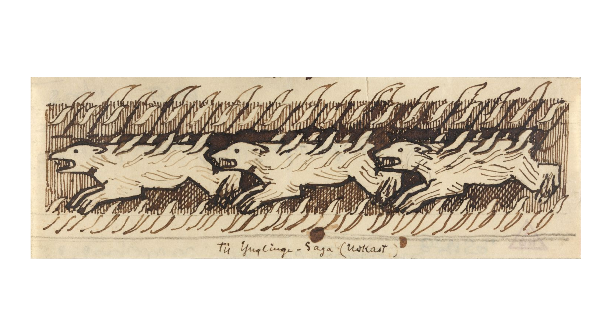

# Dimma og Draugr

> De lev i det kalde nord, langt frå maktsentra sør i Europa. Kristendommen sprer om seg, men mange held endå dei gamle gudane ved hevd.
>
>De er ei brokete forsamling som av ulike grunnar er tvungne til å legga ut på eventyr. Kanskje du har vorte urettmessig skulda for eit brotsverk og må byrja eit nytt liv, skuldar ein mektig person ei stor teneste eller du må setta livet på spel for å verna noko du har kjært?

__Under er nokre sanningar om verda.__ For å læra meir om verda må ein __spela for å finna ut__.

## Gudar og magi

* __Trua på Kvitekrist sprer om seg, men mange trur endå på dei gamle gudane.__ Også blant dei som tilber den nye guden heng mange av dei gamle tradisjonane og verdian igjen.

* __I følgje dei gamle gudane kjem alle som er drepne i kamp til Valhall__, medan dei som døyr av alderdom kjem til Hel.

* __Alle trur på magi.__ I form av kristne mirakel, heidenske forbanningar og skrømt, vetter og andre unaturlege vesen.

## Ærefull krigarkultur

* __Krigarane vert sett opp til__, og dess finare våpen du har dess høgare status får du.

* __Æra må vernast for ein kvar pris.__ Det er betre å døy ung og ærefull, enn gamal og grå. Det minste ymt av ærestap må reagerast mot, og sigerherren i ein konflikt vinn noko av æra til taparen.

* __Samfunnet er hierarkisk__. Dei gamle høvdingane og stormennene er på topp, men er avhengige av bøndene sin støtte. Bøndene er frie (for det meste) menn, som eig land. Dei er avhengige av høvdingane for vern. Trællane er ufrie, som slavar, og er nederst på rangstigen.

* __Gåver er makt__. Plikta til å gjengjelda ei gåva er lika stor som plikta til å ta imot. For å etablera makt kan ein gje dyre gåver til nokon som ikkje kan gjengjelda dei, då må dei gjengeldast på andre vis.

## Våpen utstyr og klede  

* __Dei vanlegaste våpena er spyd, øks, sverd og skjold__. Dei rike har råd til ringbrynja og hjelm, og stasleg utsmykking på utstyr og våpen. Dei fattige må ta til takke med det dei har – økser, knivar, stokkar og kasting av stein.

* __Dei fleste våpen og det meste av reidskaper er laga av jern__. Smykker og dekorative element kan vera laga av bronse, gull, sylv eller til og med bly.

* __Dei fleste klede er laga av lin eller ull__. Ytterklede, sko og belter er laga av skinn og lær, og pels vert brukt både som pynt og for å halda varmen. 

## Det lunefulle fjellet

* __Jakt, fiske og beiteområder er viktige ressursar, men vêret skifter fort og mange trekk sitt siste andedrag i høgfjellet__. Store delar av fjella er uoppdaga, og det finst ikkje gode kart.

* __Folk fortel at dei har sett både vetter, troll og skrømt i fjellet.__ Ein må passa seg for ikkje å bli bergteken.
